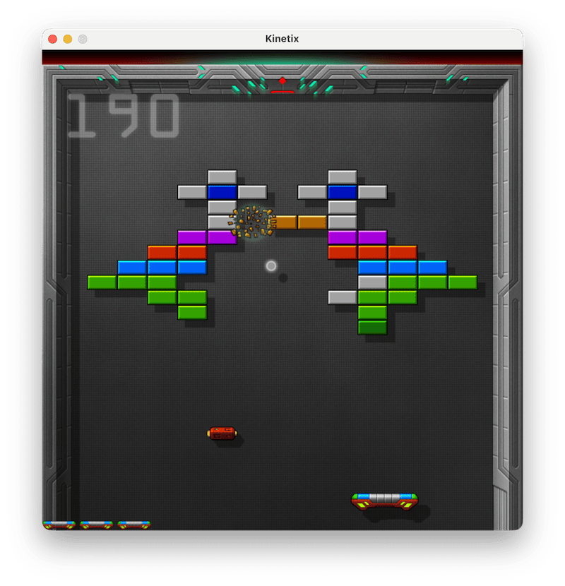

# Kinetix

Kinetix is a fast-paced brick-breaking arcade game. Control a bat, keep the ball in play, clear each level of bricks,
collect power-ups, and enter the portal to advance.



## Features

- Single-player and two-player modes
- Keyboard and joystick controls
- Multiple brick layouts with destructible, multi-hit, and indestructible bricks
- Power-ups including bat size changes, magnet, gun, multiball, ball-speed modifiers, portals, and extra lives
- Fullscreen mode
- Animated effects, sound effects, music track

## Controls

| Action | Player 1 | Player 2 |
| --- | --- | --- |
| Move left | Left Arrow | A |
| Move right | Right Arrow | D |
| Fire / select | Space | S |

Joysticks are also supported for up to two players. At the title screen, use Up/Down to select one or two players, then
press the fire button to start (X for PlayStation controllers). During a game, press Enter to pause and Escape to
return to the title screen; press Escape from the title screen to quit.

## Run

Kinetix requires [uv](https://docs.astral.sh/uv/) (Python package and project manager) to be installed.

Run the game with uv (all dependencies will be installed automatically on the first launch):

```sh
uv run main.py
```

The game starts in fullscreen mode. Run `uv run main.py --debug` for a windowed display.

## Tests

Run the test suite with:

```sh
uv run pytest
```

## Levels

Levels are editable [Tiled](https://www.mapeditor.org/) TMX maps in `levels/`. Each map uses the shared
`bricks.tsx` tileset and its `Bricks` tile layer; empty cells use tile ID `0`, and brick tiles use IDs `1` through `14`
to correspond to `brick0.png` through `brickd.png`.

## Credits

Kinetix is based on the original work from the
[Code the Classics II](https://store.rpipress.cc/products/code-the-classics-volume-ii) book and was improved by
Alexey "SibProgrammer" Yuzhakov.
