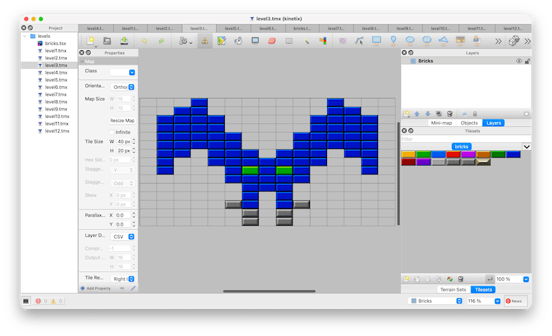

# Kinetix

[](https://github.com/sibprogrammer/game-kinetix/actions/workflows/test.yml)

Kinetix is a fast-paced brick-breaking arcade game. Control a bat, keep the ball in play, clear each level of bricks,
collect power-ups, and enter the portal to advance.


## Features

- Single-player and two-player modes
- Keyboard and joystick controls
- Multiple brick layouts with destructible, multi-hit, and indestructible bricks
- Power-ups including bat size changes, magnet, gun, multiball, ball-speed modifiers, portals, and extra lives
- Meanies that emerge from top portals, fall through the arena, and deflect balls when hit
- Persistent settings and top-ten high-score table
- Fullscreen mode
- Animated effects, sound effects, music track

## Controls

| Action | Player 1 | Player 2 |
| --- | --- | --- |
| Bat | Right | Left |
| Move left | Left Arrow | A |
| Move right | Right Arrow | D |
| Fire / select | Space | S |

Joysticks are also supported for up to two players. At the title screen, use Up/Down and Space to select **Start**,
**Settings**, or **Exit**. Select Start to choose one or two players on the next screen. During a game, press Enter
to pause and Escape to return to the title screen; select **Back** or press Escape to return from player selection.
Press Escape from the title screen to quit.

## Run

A macOS application bundle and DMG are available from the
[GitHub Releases](https://github.com/sibprogrammer/game-kinetix/releases).

## Development

Kinetix requires [uv](https://docs.astral.sh/uv/) (Python package and project manager) to be installed.

Run the game with uv (all dependencies will be installed automatically on the first launch):

```sh
uv run main.py
```

The game starts in fullscreen mode. Use `--windowed` to run in a window:

```sh
uv run main.py --windowed
```

Use `--debug` to enable debug controls. It can be combined with `--windowed`:

```sh
uv run main.py --windowed --debug
```

| Debug key | Action |
| --- | --- |
| D | Toggle debug output |
| G | End the current game |
| P | Activate the portal |

### Build macOS DMG

On macOS, create a local application bundle and DMG with:

```sh
./build.sh
```

The artifact is written to `dist/Kinetix-local.dmg`. Pass an optional label to use it in the artifact name, for example
`./build.sh v1.0.0` creates `dist/Kinetix-v1.0.0.dmg`.

### Tests

Run the test suite with:

```sh
uv run pytest
```

## Levels

Levels are editable [Tiled](https://www.mapeditor.org/) TMX maps in `levels/`. Each map uses the shared
`bricks.tsx` tileset and its `Bricks` tile layer; empty cells use tile ID `0`, and brick tiles use IDs `1` through `14`
to correspond to `brick0.png` through `brickd.png`.



## Credits

Kinetix is based on the original work from the
[Code the Classics II](https://store.rpipress.cc/products/code-the-classics-volume-ii) book and was improved by
Alexey "SibProgrammer" Yuzhakov.
